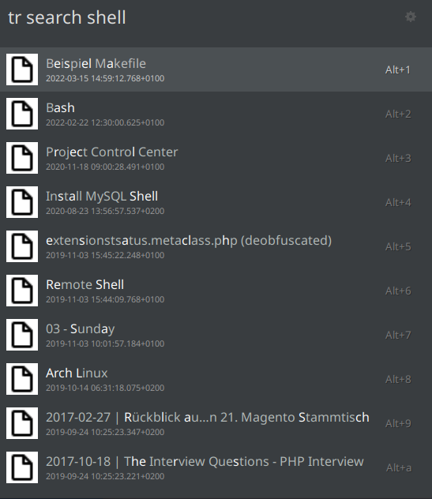

# Trilium Ulauncher Extension

## Prequisite

A hosted [Trilium Server Installation](https://github.com/zadam/trilium/wiki/Server-installation) is required!

## Configuration

Create an API Key for Trilium API for ETAPI (REST API).
See: https://github.com/zadam/trilium/wiki/ETAPI

Add the Base URL (without "/etapi") of your Trilium installation in the settings.  
Add the API Key in the settings.

## Features

- Fulltext search for notes

## License

The extension contains boxicons.
https://github.com/atisawd/boxicons
